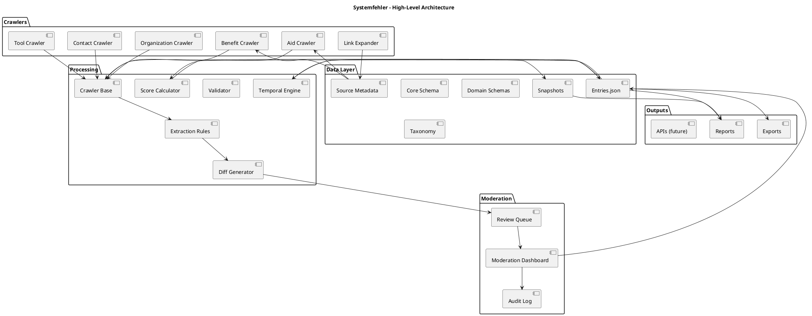

# Systemfehler – System Blueprint

This document provides textual system diagrams in two formats:

- PlantUML
- Mermaid

Both describe the same high-level architecture. You can use whichever tool fits your toolchain.

---

## 1. PlantUML Diagram

Save the following as `docs/blueprint.puml` if you want a standalone file:



---

## 2. Mermaid Diagram

Save the following as `docs/blueprint.mmd` or embed it into a markdown viewer that supports Mermaid:

```mermaid
flowchart TD

subgraph Crawlers
  BC[Benefit Crawler]
  AC[Aid Crawler]
  TC[Tool Crawler]
  OC[Organization Crawler]
  CC[Contact Crawler]
  LE[Link Expander]
end

subgraph Processing
  CB[Crawler Base]
  ER[Extraction Rules]
  DG[Diff Generator]
  VA[Validator]
  SC[Score Calculator]
  TE[Temporal Engine]
end

subgraph DataLayer
  CS[Core Schema]
  DS[Domain Schemas]
  TX[Taxonomy]
  EN[Entries.json]
  SS[Snapshots]
  SM[Source Metadata]
end

subgraph Moderation
  RQ[Review Queue]
  AL[Audit Log]
  MD[Moderation Dashboard]
end

subgraph Outputs
  EX[Exports]
  RP[Reports]
  API[APIs (future)]
end

BC --> CB
AC --> CB
TC --> CB
OC --> CB
CC --> CB

CB --> ER
ER --> DG
DG --> RQ

RQ --> MD
MD --> EN
MD --> AL

EN --> SC
EN --> TE
SC --> EN
TE --> SS

EN --> EX
EN --> RP
SS --> RP

LE --> SM
SM --> BC
SM --> AC
```

These diagrams are intended to be kept in sync with `docs/architecture.md` as the project evolves.
