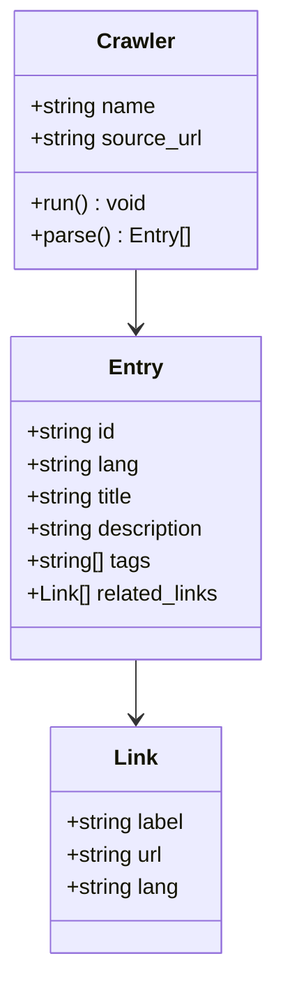
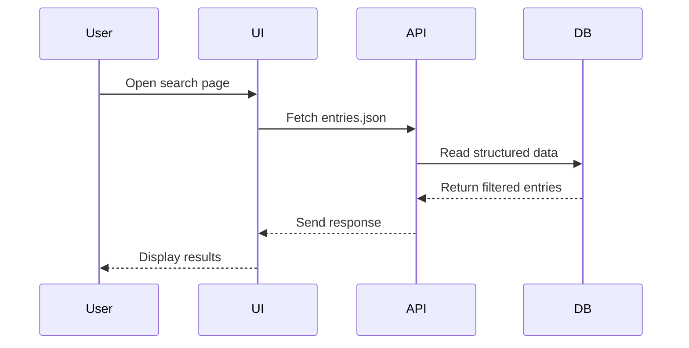

# 📐 systemfehler – UML Diagrams

## Component Diagram

```mermaid
graph TD
  subgraph Frontend
    A1[Nuxt 3 UI]
    A2[Vue Components]
  end

  subgraph Backend
    B1[API Tools (FastAPI/Flask)]
    B2[Crawler Modules]
    B3[LLM Enrichment CLI]
  end

  subgraph Data
    C1[entries.json]
    C2[urls.json]
    C3[slogans.json]
  end

  A1 --> B1
  B1 --> C1
  B2 --> C1
  B2 --> C2
  B3 --> C1
  A1 --> C3
```


---

## Class Diagram




---

## Sequence Diagram




---

