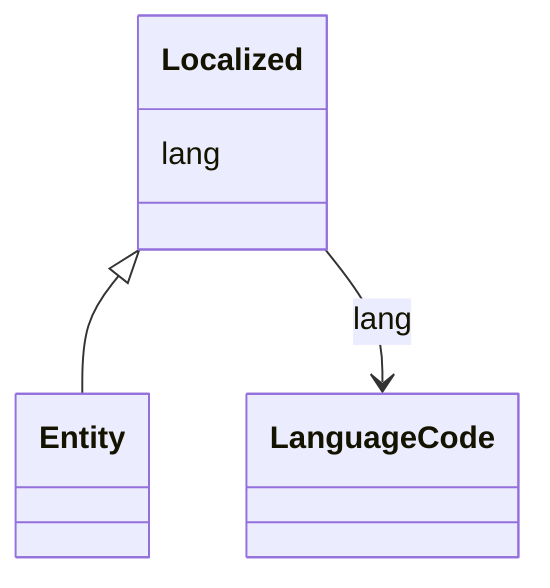

# Class: Localized


URI: [https://systemfehler.dev/schema/Localized](https://systemfehler.dev/schema/Localized)





<!-- no inheritance hierarchy -->


## Slots

| Name | Cardinality and Range | Description | Inheritance |
| ---  | --- | --- | --- |
| [lang](lang.md) | 0..1 <br/> [LanguageCode](LanguageCode.md) |  | direct |


## Mixin Usage

| mixed into | description |
| --- | --- |
| [Entity](Entity.md) |  |


## Identifier and Mapping Information


### Schema Source


* from schema: https://systemfehler.dev/schema


## Mappings

| Mapping Type | Mapped Value |
| ---  | ---  |
| self | https://systemfehler.dev/schema/Localized |
| native | https://systemfehler.dev/schema/Localized |


## LinkML Source

<!-- TODO: investigate https://stackoverflow.com/questions/37606292/how-to-create-tabbed-code-blocks-in-mkdocs-or-sphinx -->

### Direct

<details>
```yaml
name: Localized
from_schema: https://systemfehler.dev/schema
mixin: true
slots:
- lang

```
</details>

### Induced

<details>
```yaml
name: Localized
from_schema: https://systemfehler.dev/schema
mixin: true
attributes:
  lang:
    name: lang
    from_schema: https://systemfehler.dev/schema
    rank: 1000
    alias: lang
    owner: Localized
    domain_of:
    - Localized
    - StagingEntry
    - Entity
    - TextVariant
    range: LanguageCode

```
</details>