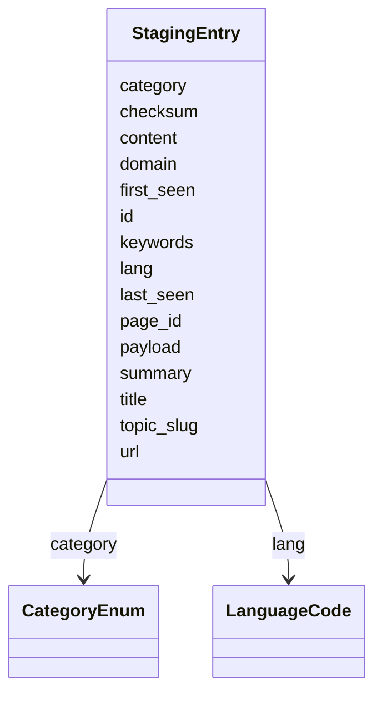

# Class: StagingEntry


URI: [https://systemfehler.dev/schema/StagingEntry](https://systemfehler.dev/schema/StagingEntry)





<!-- no inheritance hierarchy -->


## Slots

| Name | Cardinality and Range | Description | Inheritance |
| ---  | --- | --- | --- |
| [id](id.md) | 1..1 <br/> [String](String.md) |  | direct |
| [category](category.md) | 0..1 <br/> [CategoryEnum](CategoryEnum.md) |  | direct |
| [url](url.md) | 0..1 <br/> [String](String.md) |  | direct |
| [domain](domain.md) | 0..1 <br/> [String](String.md) |  | direct |
| [title](title.md) | 0..1 <br/> [String](String.md) |  | direct |
| [summary](summary.md) | 0..1 <br/> [String](String.md) |  | direct |
| [content](content.md) | 0..1 <br/> [String](String.md) |  | direct |
| [lang](lang.md) | 0..1 <br/> [LanguageCode](LanguageCode.md) |  | direct |
| [topic_slug](topic_slug.md) | 0..1 <br/> [String](String.md) |  | direct |
| [keywords](keywords.md) | 0..* <br/> [String](String.md) |  | direct |
| [payload](payload.md) | 0..1 <br/> [String](String.md) |  | direct |
| [first_seen](first_seen.md) | 0..1 <br/> [Datetime](Datetime.md) |  | direct |
| [last_seen](last_seen.md) | 0..1 <br/> [Datetime](Datetime.md) |  | direct |
| [checksum](checksum.md) | 0..1 <br/> [String](String.md) |  | direct |
| [page_id](page_id.md) | 0..1 <br/> [String](String.md) |  | direct |


## Identifier and Mapping Information


### Schema Source


* from schema: https://systemfehler.dev/schema


## Mappings

| Mapping Type | Mapped Value |
| ---  | ---  |
| self | https://systemfehler.dev/schema/StagingEntry |
| native | https://systemfehler.dev/schema/StagingEntry |


## LinkML Source

<!-- TODO: investigate https://stackoverflow.com/questions/37606292/how-to-create-tabbed-code-blocks-in-mkdocs-or-sphinx -->

### Direct

<details>
```yaml
name: StagingEntry
from_schema: https://systemfehler.dev/schema
slots:
- id
- category
- url
- domain
- title
- summary
- content
- lang
- topic_slug
- keywords
- payload
- first_seen
- last_seen
- checksum
- page_id

```
</details>

### Induced

<details>
```yaml
name: StagingEntry
from_schema: https://systemfehler.dev/schema
attributes:
  id:
    name: id
    from_schema: https://systemfehler.dev/schema
    rank: 1000
    identifier: true
    alias: id
    owner: StagingEntry
    domain_of:
    - StagingEntry
    - Entity
    range: string
    required: true
  category:
    name: category
    from_schema: https://systemfehler.dev/schema
    rank: 1000
    alias: category
    owner: StagingEntry
    domain_of:
    - StagingEntry
    range: CategoryEnum
  url:
    name: url
    from_schema: https://systemfehler.dev/schema
    rank: 1000
    alias: url
    owner: StagingEntry
    domain_of:
    - StagingEntry
    - Entity
    range: string
  domain:
    name: domain
    from_schema: https://systemfehler.dev/schema
    rank: 1000
    alias: domain
    owner: StagingEntry
    domain_of:
    - StagingEntry
    range: string
  title:
    name: title
    from_schema: https://systemfehler.dev/schema
    rank: 1000
    alias: title
    owner: StagingEntry
    domain_of:
    - StagingEntry
    - Entity
    range: string
  summary:
    name: summary
    from_schema: https://systemfehler.dev/schema
    rank: 1000
    alias: summary
    owner: StagingEntry
    domain_of:
    - StagingEntry
    - Entity
    range: string
  content:
    name: content
    from_schema: https://systemfehler.dev/schema
    rank: 1000
    alias: content
    owner: StagingEntry
    domain_of:
    - StagingEntry
    range: string
  lang:
    name: lang
    from_schema: https://systemfehler.dev/schema
    rank: 1000
    alias: lang
    owner: StagingEntry
    domain_of:
    - Localized
    - StagingEntry
    - Entity
    - TextVariant
    range: LanguageCode
  topic_slug:
    name: topic_slug
    from_schema: https://systemfehler.dev/schema
    rank: 1000
    alias: topic_slug
    owner: StagingEntry
    domain_of:
    - StagingEntry
    range: string
  keywords:
    name: keywords
    from_schema: https://systemfehler.dev/schema
    rank: 1000
    alias: keywords
    owner: StagingEntry
    domain_of:
    - StagingEntry
    - Entity
    range: string
    multivalued: true
  payload:
    name: payload
    from_schema: https://systemfehler.dev/schema
    rank: 1000
    alias: payload
    owner: StagingEntry
    domain_of:
    - StagingEntry
    range: string
  first_seen:
    name: first_seen
    from_schema: https://systemfehler.dev/schema
    rank: 1000
    alias: first_seen
    owner: StagingEntry
    domain_of:
    - StagingEntry
    range: datetime
  last_seen:
    name: last_seen
    from_schema: https://systemfehler.dev/schema
    rank: 1000
    alias: last_seen
    owner: StagingEntry
    domain_of:
    - StagingEntry
    range: datetime
  checksum:
    name: checksum
    from_schema: https://systemfehler.dev/schema
    rank: 1000
    alias: checksum
    owner: StagingEntry
    domain_of:
    - StagingEntry
    range: string
  page_id:
    name: page_id
    from_schema: https://systemfehler.dev/schema
    rank: 1000
    alias: page_id
    owner: StagingEntry
    domain_of:
    - StagingEntry
    range: string

```
</details>