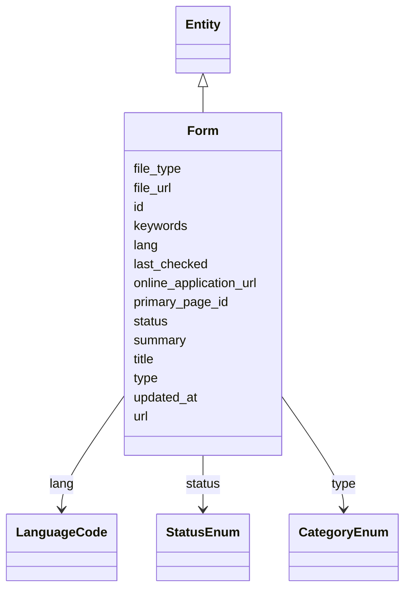

# Class: Form


URI: [https://systemfehler.dev/schema/overlay/de/Form](https://systemfehler.dev/schema/overlay/de/Form)





## Inheritance
* [Entity](Entity.md) [ [Reviewable](Reviewable.md) [Timestamps](Timestamps.md) [Localized](Localized.md)]
    * **Form**


## Slots

| Name | Cardinality and Range | Description | Inheritance |
| ---  | --- | --- | --- |
| [file_url](file_url.md) | 0..1 <br/> [String](String.md) |  | direct |
| [file_type](file_type.md) | 0..1 <br/> [String](String.md) |  | direct |
| [online_application_url](online_application_url.md) | 0..1 <br/> [String](String.md) |  | direct |
| [id](id.md) | 1..1 <br/> [String](String.md) |  | [Entity](Entity.md) |
| [url](url.md) | 0..1 <br/> [String](String.md) |  | [Entity](Entity.md) |
| [title](title.md) | 0..1 <br/> [String](String.md) |  | [Entity](Entity.md) |
| [summary](summary.md) | 0..1 <br/> [String](String.md) |  | [Entity](Entity.md) |
| [lang](lang.md) | 0..1 <br/> [LanguageCode](LanguageCode.md) |  | [Localized](Localized.md), [Entity](Entity.md) |
| [keywords](keywords.md) | 0..* <br/> [String](String.md) |  | [Entity](Entity.md) |
| [type](type.md) | 0..1 <br/> [CategoryEnum](CategoryEnum.md) |  | [Entity](Entity.md) |
| [primary_page_id](primary_page_id.md) | 0..1 <br/> [String](String.md) |  | [Entity](Entity.md) |
| [status](status.md) | 0..1 <br/> [StatusEnum](StatusEnum.md) |  | [Reviewable](Reviewable.md) |
| [last_checked](last_checked.md) | 0..1 <br/> [Datetime](Datetime.md) |  | [Reviewable](Reviewable.md) |
| [updated_at](updated_at.md) | 0..1 <br/> [Datetime](Datetime.md) |  | [Timestamps](Timestamps.md) |


## Identifier and Mapping Information


### Schema Source


* from schema: https://systemfehler.dev/schema/overlay/de


## Mappings

| Mapping Type | Mapped Value |
| ---  | ---  |
| self | https://systemfehler.dev/schema/overlay/de/Form |
| native | https://systemfehler.dev/schema/overlay/de/Form |


## LinkML Source

<!-- TODO: investigate https://stackoverflow.com/questions/37606292/how-to-create-tabbed-code-blocks-in-mkdocs-or-sphinx -->

### Direct

<details>
```yaml
name: Form
from_schema: https://systemfehler.dev/schema/overlay/de
is_a: Entity
slots:
- file_url
- file_type
- online_application_url

```
</details>

### Induced

<details>
```yaml
name: Form
from_schema: https://systemfehler.dev/schema/overlay/de
is_a: Entity
attributes:
  file_url:
    name: file_url
    from_schema: https://systemfehler.dev/schema/overlay/de
    rank: 1000
    alias: file_url
    owner: Form
    domain_of:
    - Form
    range: string
  file_type:
    name: file_type
    from_schema: https://systemfehler.dev/schema/overlay/de
    rank: 1000
    alias: file_type
    owner: Form
    domain_of:
    - Form
    range: string
  online_application_url:
    name: online_application_url
    from_schema: https://systemfehler.dev/schema/overlay/de
    rank: 1000
    alias: online_application_url
    owner: Form
    domain_of:
    - Form
    range: string
  id:
    name: id
    from_schema: https://systemfehler.dev/schema/overlay/de
    rank: 1000
    identifier: true
    alias: id
    owner: Form
    domain_of:
    - StagingEntry
    - Entity
    range: string
    required: true
  url:
    name: url
    from_schema: https://systemfehler.dev/schema/overlay/de
    rank: 1000
    alias: url
    owner: Form
    domain_of:
    - StagingEntry
    - Entity
    range: string
  title:
    name: title
    from_schema: https://systemfehler.dev/schema/overlay/de
    rank: 1000
    alias: title
    owner: Form
    domain_of:
    - StagingEntry
    - Entity
    range: string
  summary:
    name: summary
    from_schema: https://systemfehler.dev/schema/overlay/de
    rank: 1000
    alias: summary
    owner: Form
    domain_of:
    - StagingEntry
    - Entity
    range: string
  lang:
    name: lang
    from_schema: https://systemfehler.dev/schema/overlay/de
    rank: 1000
    alias: lang
    owner: Form
    domain_of:
    - Localized
    - StagingEntry
    - Entity
    - TextVariant
    range: LanguageCode
  keywords:
    name: keywords
    from_schema: https://systemfehler.dev/schema/overlay/de
    rank: 1000
    alias: keywords
    owner: Form
    domain_of:
    - StagingEntry
    - Entity
    range: string
    multivalued: true
  type:
    name: type
    from_schema: https://systemfehler.dev/schema/overlay/de
    rank: 1000
    alias: type
    owner: Form
    domain_of:
    - Entity
    range: CategoryEnum
  primary_page_id:
    name: primary_page_id
    from_schema: https://systemfehler.dev/schema/overlay/de
    rank: 1000
    alias: primary_page_id
    owner: Form
    domain_of:
    - Entity
    range: string
  status:
    name: status
    from_schema: https://systemfehler.dev/schema/overlay/de
    rank: 1000
    alias: status
    owner: Form
    domain_of:
    - Reviewable
    range: StatusEnum
  last_checked:
    name: last_checked
    from_schema: https://systemfehler.dev/schema/overlay/de
    rank: 1000
    alias: last_checked
    owner: Form
    domain_of:
    - Reviewable
    range: datetime
  updated_at:
    name: updated_at
    from_schema: https://systemfehler.dev/schema/overlay/de
    rank: 1000
    alias: updated_at
    owner: Form
    domain_of:
    - Timestamps
    range: datetime

```
</details>