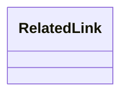

# Class: RelatedLink


URI: [https://systemfehler.dev/schema/overlay/de/RelatedLink](https://systemfehler.dev/schema/overlay/de/RelatedLink)





<!-- no inheritance hierarchy -->


## Slots

| Name | Cardinality and Range | Description | Inheritance |
| ---  | --- | --- | --- |


## Identifier and Mapping Information


### Schema Source


* from schema: https://systemfehler.dev/schema/overlay/de


## Mappings

| Mapping Type | Mapped Value |
| ---  | ---  |
| self | https://systemfehler.dev/schema/overlay/de/RelatedLink |
| native | https://systemfehler.dev/schema/overlay/de/RelatedLink |


## LinkML Source

<!-- TODO: investigate https://stackoverflow.com/questions/37606292/how-to-create-tabbed-code-blocks-in-mkdocs-or-sphinx -->

### Direct

<details>
```yaml
name: RelatedLink
from_schema: https://systemfehler.dev/schema/overlay/de

```
</details>

### Induced

<details>
```yaml
name: RelatedLink
from_schema: https://systemfehler.dev/schema/overlay/de

```
</details>