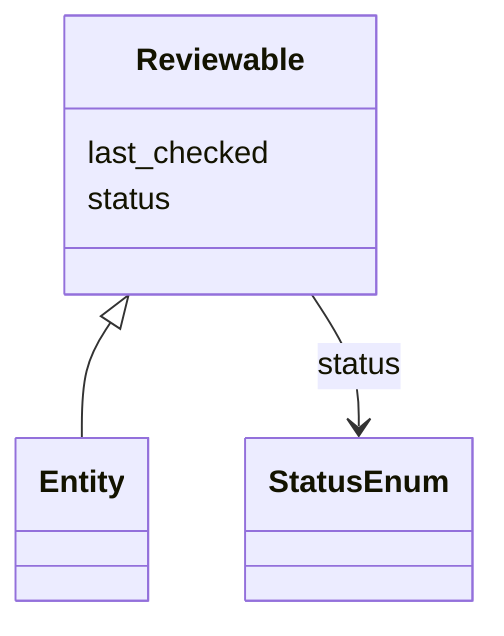

# Class: Reviewable


URI: [https://systemfehler.dev/schema/overlay/de/Reviewable](https://systemfehler.dev/schema/overlay/de/Reviewable)





<!-- no inheritance hierarchy -->


## Slots

| Name | Cardinality and Range | Description | Inheritance |
| ---  | --- | --- | --- |
| [status](status.md) | 0..1 <br/> [StatusEnum](StatusEnum.md) |  | direct |
| [last_checked](last_checked.md) | 0..1 <br/> [Datetime](Datetime.md) |  | direct |


## Mixin Usage

| mixed into | description |
| --- | --- |
| [Entity](Entity.md) |  |


## Identifier and Mapping Information


### Schema Source


* from schema: https://systemfehler.dev/schema/overlay/de


## Mappings

| Mapping Type | Mapped Value |
| ---  | ---  |
| self | https://systemfehler.dev/schema/overlay/de/Reviewable |
| native | https://systemfehler.dev/schema/overlay/de/Reviewable |


## LinkML Source

<!-- TODO: investigate https://stackoverflow.com/questions/37606292/how-to-create-tabbed-code-blocks-in-mkdocs-or-sphinx -->

### Direct

<details>
```yaml
name: Reviewable
from_schema: https://systemfehler.dev/schema/overlay/de
mixin: true
slots:
- status
- last_checked

```
</details>

### Induced

<details>
```yaml
name: Reviewable
from_schema: https://systemfehler.dev/schema/overlay/de
mixin: true
attributes:
  status:
    name: status
    from_schema: https://systemfehler.dev/schema/overlay/de
    rank: 1000
    alias: status
    owner: Reviewable
    domain_of:
    - Reviewable
    range: StatusEnum
  last_checked:
    name: last_checked
    from_schema: https://systemfehler.dev/schema/overlay/de
    rank: 1000
    alias: last_checked
    owner: Reviewable
    domain_of:
    - Reviewable
    range: datetime

```
</details>