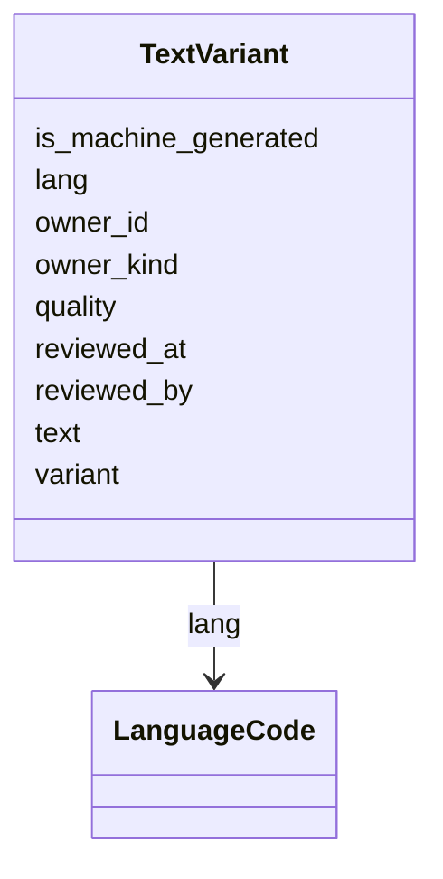

# Class: TextVariant


URI: [https://systemfehler.dev/schema/overlay/de/TextVariant](https://systemfehler.dev/schema/overlay/de/TextVariant)





<!-- no inheritance hierarchy -->


## Slots

| Name | Cardinality and Range | Description | Inheritance |
| ---  | --- | --- | --- |
| [owner_kind](owner_kind.md) | 0..1 <br/> [String](String.md) |  | direct |
| [owner_id](owner_id.md) | 0..1 <br/> [String](String.md) |  | direct |
| [lang](lang.md) | 0..1 <br/> [LanguageCode](LanguageCode.md) |  | direct |
| [variant](variant.md) | 0..1 <br/> [String](String.md) |  | direct |
| [text](text.md) | 0..1 <br/> [String](String.md) |  | direct |
| [is_machine_generated](is_machine_generated.md) | 0..1 <br/> [String](String.md) |  | direct |
| [quality](quality.md) | 0..1 <br/> [String](String.md) |  | direct |
| [reviewed_by](reviewed_by.md) | 0..1 <br/> [String](String.md) |  | direct |
| [reviewed_at](reviewed_at.md) | 0..1 <br/> [Datetime](Datetime.md) |  | direct |


## Identifier and Mapping Information


### Schema Source


* from schema: https://systemfehler.dev/schema/overlay/de


## Mappings

| Mapping Type | Mapped Value |
| ---  | ---  |
| self | https://systemfehler.dev/schema/overlay/de/TextVariant |
| native | https://systemfehler.dev/schema/overlay/de/TextVariant |


## LinkML Source

<!-- TODO: investigate https://stackoverflow.com/questions/37606292/how-to-create-tabbed-code-blocks-in-mkdocs-or-sphinx -->

### Direct

<details>
```yaml
name: TextVariant
from_schema: https://systemfehler.dev/schema/overlay/de
slots:
- owner_kind
- owner_id
- lang
- variant
- text
- is_machine_generated
- quality
- reviewed_by
- reviewed_at

```
</details>

### Induced

<details>
```yaml
name: TextVariant
from_schema: https://systemfehler.dev/schema/overlay/de
attributes:
  owner_kind:
    name: owner_kind
    from_schema: https://systemfehler.dev/schema/overlay/de
    rank: 1000
    alias: owner_kind
    owner: TextVariant
    domain_of:
    - TextVariant
    range: string
  owner_id:
    name: owner_id
    from_schema: https://systemfehler.dev/schema/overlay/de
    rank: 1000
    alias: owner_id
    owner: TextVariant
    domain_of:
    - TextVariant
    range: string
  lang:
    name: lang
    from_schema: https://systemfehler.dev/schema/overlay/de
    rank: 1000
    alias: lang
    owner: TextVariant
    domain_of:
    - Localized
    - StagingEntry
    - Entity
    - TextVariant
    range: LanguageCode
  variant:
    name: variant
    from_schema: https://systemfehler.dev/schema/overlay/de
    rank: 1000
    alias: variant
    owner: TextVariant
    domain_of:
    - TextVariant
    range: string
  text:
    name: text
    from_schema: https://systemfehler.dev/schema/overlay/de
    rank: 1000
    alias: text
    owner: TextVariant
    domain_of:
    - TextVariant
    range: string
  is_machine_generated:
    name: is_machine_generated
    from_schema: https://systemfehler.dev/schema/overlay/de
    rank: 1000
    alias: is_machine_generated
    owner: TextVariant
    domain_of:
    - TextVariant
    range: string
  quality:
    name: quality
    from_schema: https://systemfehler.dev/schema/overlay/de
    rank: 1000
    alias: quality
    owner: TextVariant
    domain_of:
    - TextVariant
    range: string
  reviewed_by:
    name: reviewed_by
    from_schema: https://systemfehler.dev/schema/overlay/de
    rank: 1000
    alias: reviewed_by
    owner: TextVariant
    domain_of:
    - TextVariant
    range: string
  reviewed_at:
    name: reviewed_at
    from_schema: https://systemfehler.dev/schema/overlay/de
    rank: 1000
    alias: reviewed_at
    owner: TextVariant
    domain_of:
    - TextVariant
    range: datetime

```
</details>