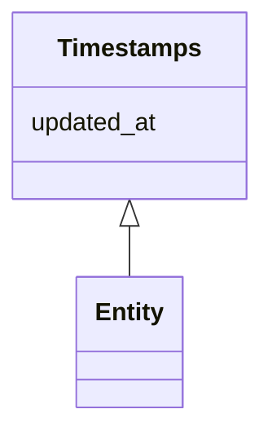

# Class: Timestamps


URI: [https://systemfehler.dev/schema/overlay/de/Timestamps](https://systemfehler.dev/schema/overlay/de/Timestamps)





<!-- no inheritance hierarchy -->


## Slots

| Name | Cardinality and Range | Description | Inheritance |
| ---  | --- | --- | --- |
| [updated_at](updated_at.md) | 0..1 <br/> [Datetime](Datetime.md) |  | direct |


## Mixin Usage

| mixed into | description |
| --- | --- |
| [Entity](Entity.md) |  |


## Identifier and Mapping Information


### Schema Source


* from schema: https://systemfehler.dev/schema/overlay/de


## Mappings

| Mapping Type | Mapped Value |
| ---  | ---  |
| self | https://systemfehler.dev/schema/overlay/de/Timestamps |
| native | https://systemfehler.dev/schema/overlay/de/Timestamps |


## LinkML Source

<!-- TODO: investigate https://stackoverflow.com/questions/37606292/how-to-create-tabbed-code-blocks-in-mkdocs-or-sphinx -->

### Direct

<details>
```yaml
name: Timestamps
from_schema: https://systemfehler.dev/schema/overlay/de
mixin: true
slots:
- updated_at

```
</details>

### Induced

<details>
```yaml
name: Timestamps
from_schema: https://systemfehler.dev/schema/overlay/de
mixin: true
attributes:
  updated_at:
    name: updated_at
    from_schema: https://systemfehler.dev/schema/overlay/de
    rank: 1000
    alias: updated_at
    owner: Timestamps
    domain_of:
    - Timestamps
    range: datetime

```
</details>